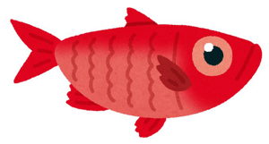
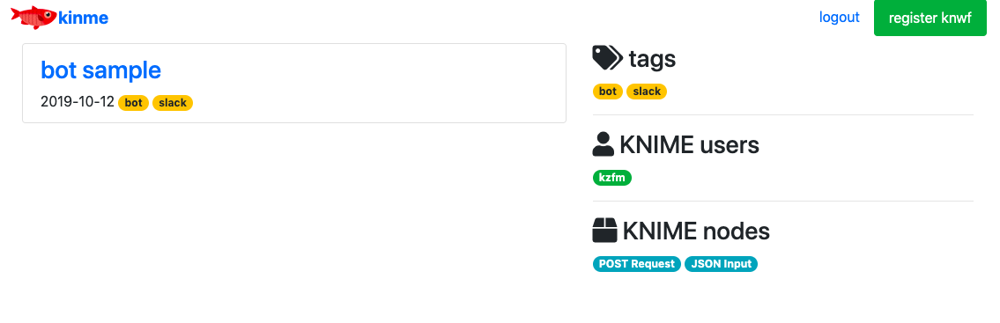
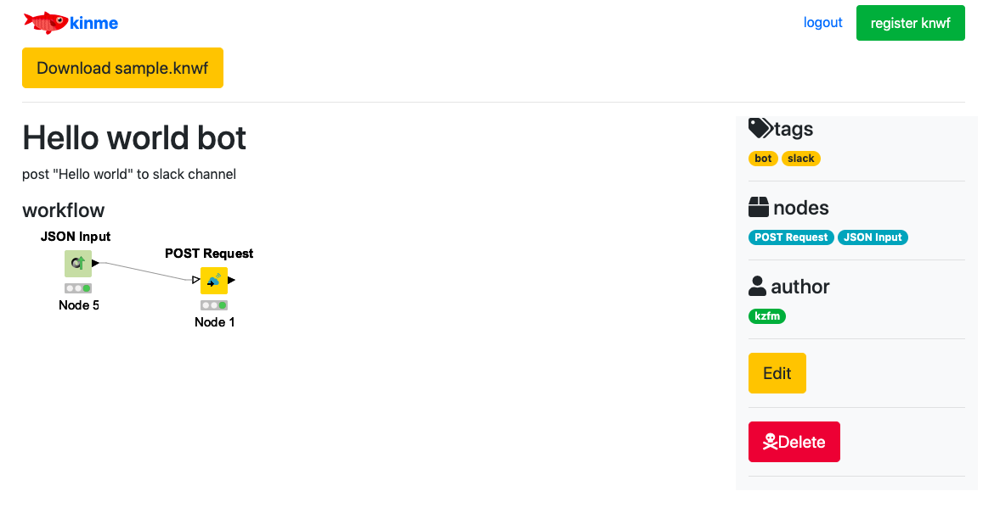

# kinme

Kinme is a KNIME workflow sharing system written in Python and its name is the anagram of KNIME. Izu peninsula is known as the producer of Kinme (Kinmedai), [a high class fish](https://www.thesushigeek.com/the-sushi-geek/2016/01/17/kinmedai-%E9%87%91%E7%9B%AE%E9%AF%9B-splendid-alfonsino) in Japan.

## Setup

Install modules

    conda install -c conda-forge flask-sqlalchemy
    conda install -c conda-forge flask-login
    conda install -c conda-forge flask-wtf
    conda install -c conda-forge cairosvg
    conda install -c conda-forge markdown

clone or download this repository

setup database

    python refreshdb.py

launch flask server

    export FLASK_APP=app.py
    flask run

## Screenshots

